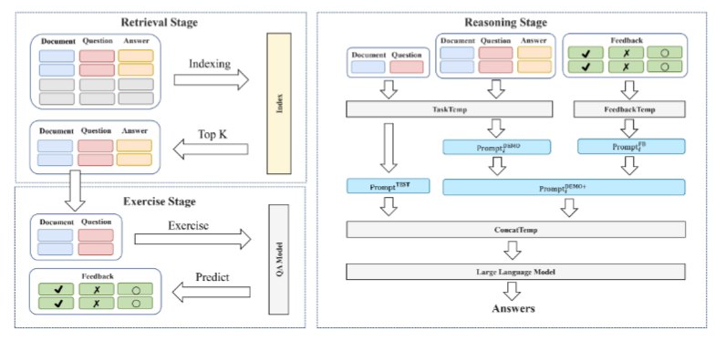

# FBPrompt
Code for [Enhancing In-Context Learning with Answer Feedback for Multi-Span Question Answering](https://arxiv.org/pdf/2306.04508.pdf) (NLPCC 2023)

We propose a novel way of employing labeled data such that it also informs LLM of some undesired output, by extending demonstration examples with feedback about answers predicted by an off-the-shelf model, e.g., correct, incorrect, or incomplete.

### Prepares
- Pasting your OpenAI key to LLM.py
- Installing openai package: pip install openai



As shown in the above figure, FBPrompt includes a retrieval stage
searching for relevant demonstration examples, an exercise stage for producing
feedback, and a reasoning stage for in-context learning with feedback.


The results of the first two steps are provided in the *dataset* folder.

#### Exercise Stage
We run the t5 model implemented by MindSpore at this stage. The package **mindspore** and **mindnlp** is needed to be installed. 

```angular2html
python exercise.py --model_name t5-small --gpu 0
```

#### Retrieval Stage
```angular2html
python retrieval.py --dataset_name msqa 
```

#### Reasoning Stage
```angular2html
python reasoning.py --baseline False --dataset_name msqa
```
