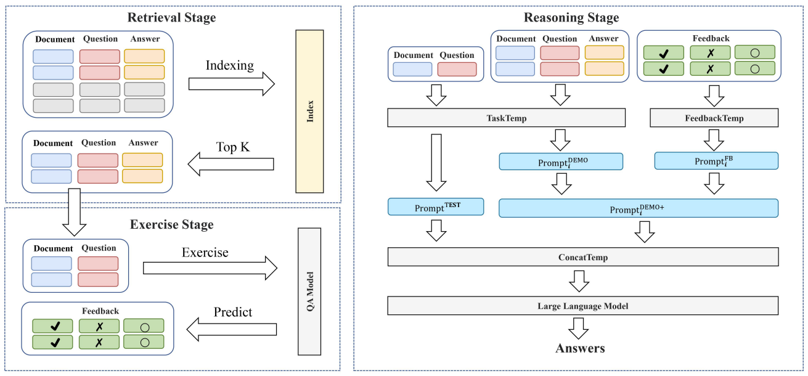

# FBPrompt
Code for [Enhancing In-Context Learning with Answer Feedback for Multi-Span Question Answering](https://github.com/nju-websoft/FBPrompt) (NLPCC 2023)

We propose a novel way of employing labeled data such that it also informs LLM of some undesired output, by extending demonstration examples with feedback about answers predicted by an off-the-shelf model, e.g., correct, incorrect, or incomplete.


### Prepares
- Pasting your OpenAI key to LLM.py
- Installing openai package: pip install openai.

Our FBPrompt including three stage: retrieval, exercise, and reasoning. The results of the first two steps are provided in the *dataset* folder.
#### Retrieval Stage
```angular2html
python retrieval.py --dataset_name msqa 
```

#### Reasoning Stage
```angular2html
python reasoning.py --baseline False --dataset_name msqa
```